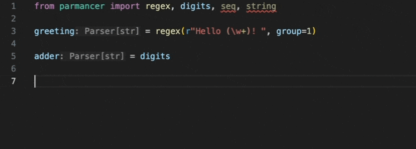
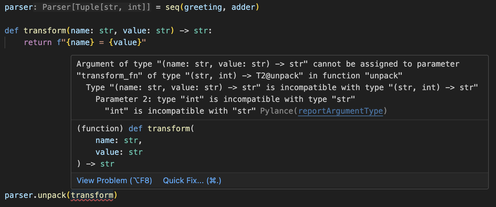

Parse text into **structured data types** with **parser combinators**.

Parmancer has rich **type annotations** for parsers and intermediate results.
Using a type checker with Parmancer gives immediate feedback about parser result types, and gives type errors when creating invalid combinations of parsers.

## Installation

```sh
pip install parmancer
```

## Introductory example

This example shows a parser which can parse text like `"Hello World! 1 + 2 + 3"` to extract the name in `Hello <name>!` and find the sum of the numbers which come after it:

```python
from parmancer import regex, digits, seq, string

# A parser which extracts a name from a greeting using a regular expression
greeting = regex(r"Hello (\w+)! ", group=1)

# A parser which takes integers separated by ` + `,
# converts them to `int`s, and sums them.
adder = digits.map(int).sep_by(string(" + ")).map(sum)

# The `greeting` and `adder` parsers are combined in sequence
parser = seq(greeting, adder)

# Now the parser can be applied to the example string, or other strings following the
# same pattern.
result = parser.parse("Hello World! 1 + 2 + 3")

# The result is a tuple containing the `greeting` result followed by the `adder` result
assert result == ("World", 6)

# Parsing different text which matches the same structure:
assert parser.parse("Hello Example! 10 + 11") == ("Example", 21)
```

Type checkers such as `mypy` and `Pylance`'s type checker help during development by revealing type information and catching type errors.

Here the in-line types are displayed automatically with VSCode's Python extension and the 'Inlay Hints' setting:



When the type of a parser doesn't match what's expected, such as in the following example, a type error reveals the problem as soon as the code is type checked, without having to run the code.
In this example the `Parser.unpack` method is being used to unpack the result tuple of type `(str, int)` into a function which expects arguments of type `(str, str)` which is a type incompatibility:



## Dataclass parsers

A key feature of Parmancer is the ability to create parsers which return dataclass instances using a short syntax where parsers are directly associated with each field of a dataclass.

Each dataclass field has a parser associated with it using the `take` field descriptor instead of the usual `dataclasses.field`.

The entire dataclass parser is then **combined** using the `gather` function, creating a parser which sequentially applies each field's parser, assigning each result to the dataclass field it is associated with.

```python
from dataclasses import dataclass
from parmancer import regex, string, take, gather

# Example text which a sensor might produce
sample_text = """Device: SensorA
ID: abc001
Readings (3:01 PM)
300.1, 301, 300
Readings (3:02 PM)
302, 1000, 2500
"""

numeric = regex(r"\d+(\.\d+)?").map(float)
any_text = regex(r"[^\n]+")
line_break = string("\n")

# Define parsers for the sensor readings and device information
@dataclass
class Reading:
    # Matches text like `Readings (3:01 PM)`
    timestamp: str = take(regex(r"Readings \(([^)]+)\)", group=1) << line_break)
    # Matches text like `300.1, 301, 300`
    values: list[float] = take(numeric.sep_by(string(", ")) << line_break)

@dataclass
class Device:
    # Matches text like `Device: SensorA`
    name: str = take(string("Device: ") >> any_text << line_break)
    # Matches text like `ID: abc001`
    id: str = take(string("ID: ") >> any_text << line_break)
    # Matches the entire `Reading` dataclass parser 0, 1 or many times
    readings: list[Reading] = take(gather(Reading).many())

# Gather the fields of the `Device` dataclass into a single combined parser
# Note the `Device.readings` field parser uses the `Reading` dataclass parser
parser = gather(Device)

# The result of the parser is a nicely structured `Device` dataclass instance,
# ready for use in the rest of the code with minimal boilerplate to get this far
assert parser.parse(sample_text) == Device(
    name="SensorA",
    id="abc001",
    readings=[
        Reading(timestamp="3:01 PM", values=[300.1, 301, 300]),
        Reading(timestamp="3:02 PM", values=[302, 1000, 2500]),
    ],
)
```

Dataclass parsers come with type annotations which make it easy to write them with hints from an IDE.
For example, a dataclass field of type `str` cannot be associated with a parser of type `Parser[int]` - the parser has to produce a string (`Parser[str]`) for it to be compatible, and a type checker can reveal this while writing code in an IDE:


## Why use Parmancer?

- **Simple construction**: Simple parsers can be defined concisely and independently, and then combined with short, understandable **combinator** functions and methods which replace the usual branching and sequencing boilerplate of parsers written in vanilla Python.
- **Modularity, testability, maintainability**: Each intermediate parser component is a complete parser in itself, which means it can be understood, tested and modified in isolation from the rest of the parser.
- **Regular Python**: Some other approaches to parsing use a separate grammar definition outside of Python which goes through a compilation or generation step before it can be used in Python, which can lead to black boxes. Parmancer parsers are defined as Python code rather than a separate grammar syntax.
- **Combination features**: The parser comes with standard parser combinator methods and functions such as: combining parsers in sequence; matching alternative parsers until one matches; making a parser optional; repeatedly matching a parser until it no longer matches; mapping a parsing result through a function, and more.
- **Type checking**: Parmancer has a lot of type information which makes it easier to use with IDEs and type checkers.

Parmancer is not for creating performant parsers, its speed is similar to other pure Python parsing libraries.
Its purpose is to create understandable, testable and maintainable parsers.

Parmancer is in development so its public API is not stable.
Please leave feedback and suggestions in the GitHub issue tracker.

Parmancer is based on [Parsy](https://parsy.readthedocs.io/en/latest/overview.html) (and [typed-parsy](https://github.com/python-parsy/typed-parsy)) which is an excellent parsing library.

## API documentation and examples

The API docs include minimal examples of each parser and combinator.

The GitHub repository has an `examples` folder containing larger examples which use multiple features.
